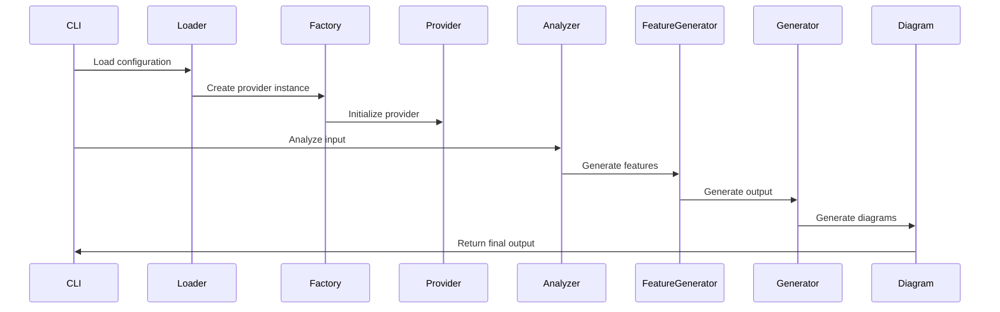
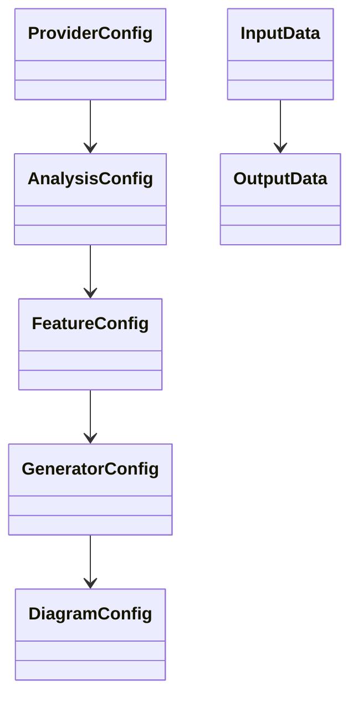
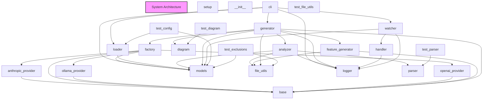

# Component Architecture

# Component Architecture Documentation

## 1. Component Breakdown

The system is composed of the following key components:

### `setup` and `__init__`
These modules handle the package setup and initialization. They are responsible for setting up the environment and making the package importable.

### `anthropic_provider`, `ollama_provider`, and `openai_provider`
These modules encapsulate the integration with different language model providers. They abstract away the provider-specific details and expose a common interface for the rest of the system to use.

### `base` and `factory`
The `base` module defines the core abstractions and interfaces used throughout the system. The `factory` module is responsible for creating instances of the appropriate provider based on the user's configuration.

### `cli`, `loader`, and `models`
The `cli` module provides the command-line interface for the system. The `loader` module is responsible for loading configuration and other data from various sources. The `models` module defines the data structures used throughout the system.

### `analyzer`, `diagram`, `feature_generator`, and `generator`
These modules work together to analyze the input data, generate diagrams, and produce the final output. The `analyzer` module is responsible for parsing and analyzing the input. The `diagram` module generates the visual diagrams. The `feature_generator` and `generator` modules work together to produce the final output.

### `file_utils`, `logger`, `parser`, `handler`, and `watcher`
These are utility modules that provide file handling, logging, parsing, and monitoring functionality to the system.

### `test_config`
This module contains the test configuration and setup for the system.

## 2. Communication Patterns

The main workflow of the system can be described as follows:

The CLI module initiates the process by loading the configuration and creating the appropriate provider instance through the factory. The analyzer module then processes the input and passes the results to the feature generator, which in turn feeds the generator module. The generator module coordinates the diagram generation and returns the final output to the CLI.

## 3. Data Models

The system uses the following key data models:

- `ProviderConfig`: Holds the configuration for the language model provider.
- `AnalysisConfig`: Specifies the parameters for the input analysis.
- `FeatureConfig`: Defines the settings for feature generation.
- `GeneratorConfig`: Configures the output generation process.
- `DiagramConfig`: Specifies the settings for diagram generation.
- `InputData`: Represents the data to be processed by the system.
- `OutputData`: Encapsulates the final output, including the generated diagrams.

## 4. Design Patterns

The system employs the following design patterns:

1. **Factory Pattern**: The `factory` module uses the factory pattern to create instances of the appropriate language model provider based on the user's configuration.

2. **Strategy Pattern**: The `anthropic_provider`, `ollama_provider`, and `openai_provider` modules implement the strategy pattern, allowing the system to use different language model providers interchangeably.

3. **Observer Pattern**: The `watcher` module uses the observer pattern to monitor changes in the input data and trigger the analysis and generation process.

4. **Decorator Pattern**: The `diagram` module uses the decorator pattern to add additional functionality to the diagram generation process, such as styling and layout.

5. **Adapter Pattern**: The `base` module acts as an adapter, providing a common interface for the different language model providers to work with the rest of the system.

## 5. Extension Points

The system is designed to be extensible, allowing users to add new language model providers, customize the analysis and generation process, and extend the functionality of the system.

To add a new language model provider, you can create a new module that implements the `ProviderInterface` defined in the `base` module. This new provider can then be used by the `factory` module to create instances as needed.

To customize the analysis and generation process, you can override the default configurations in the `AnalysisConfig`, `FeatureConfig`, `GeneratorConfig`, and `DiagramConfig` data models. This allows you to adjust the parameters and behavior of the various components to suit your specific needs.

Finally, to extend the functionality of the system, you can create new modules that integrate with the existing components. For example, you could add a new module that generates additional types of diagrams or integrates with external tools and services.

## System Architecture Diagram

