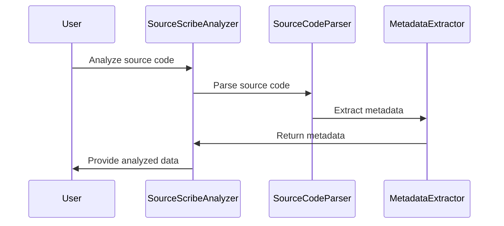
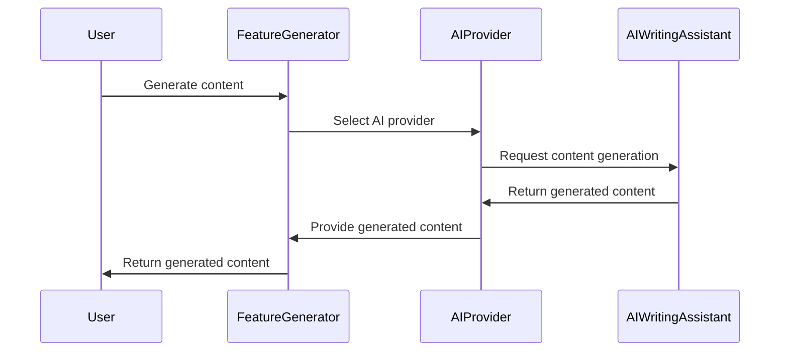
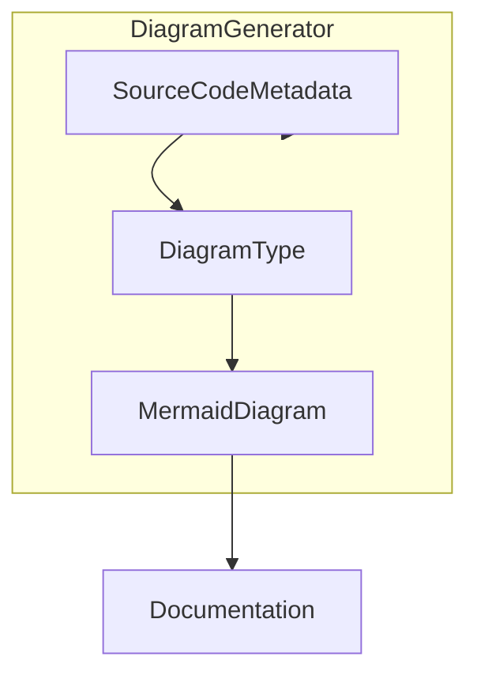
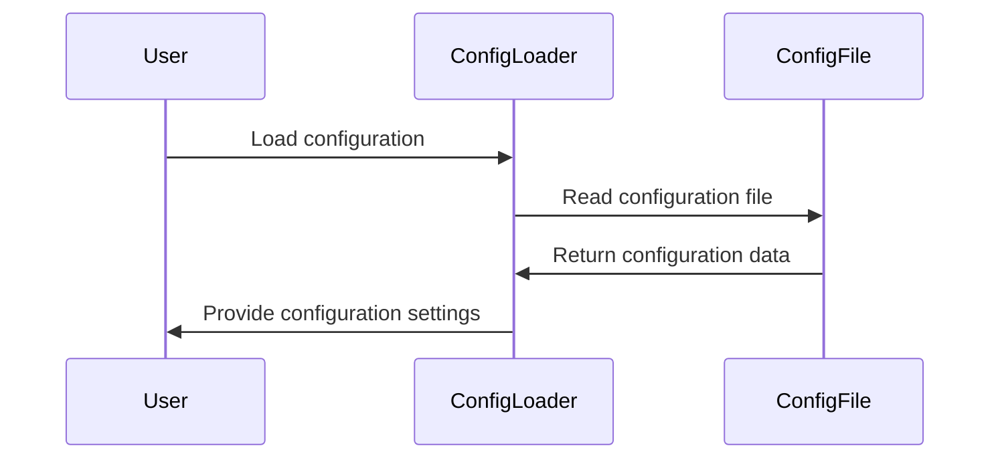
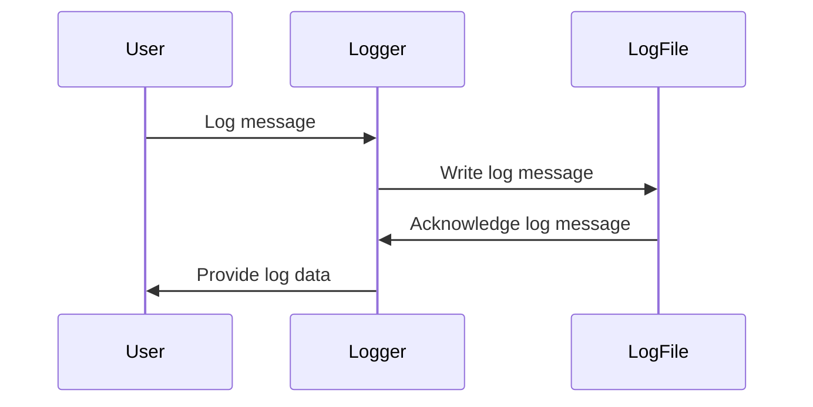

# Features

# SourceScribe Documentation

SourceScribe is a powerful documentation generation tool that automatically creates user-friendly technical documentation from source code. It supports a variety of programming languages and integrates with popular AI-powered writing assistants to generate high-quality, process-oriented documentation.

## Features

SourceScribe provides the following key features:

1. **Source Code Analysis**: Automatically parse and analyze source code to extract relevant information for documentation.
2. **AI-Powered Content Generation**: Leverage AI writing assistants like Anthropic and OpenAI to generate descriptive text for documentation.
3. **Diagram Generation**: Automatically create visual diagrams, such as sequence diagrams, flowcharts, and class diagrams, to illustrate key concepts and workflows.
4. **Configuration Management**: Flexible configuration options to customize the documentation generation process.
5. **Monitoring and Logging**: Track the status of documentation generation and debug any issues that may arise.

## Feature Walkthrough

### 1. Source Code Analysis

**Feature Overview**:
SourceScribe's core functionality is to analyze source code and extract relevant information for documentation. It supports a wide range of programming languages and can parse various file types, including Python, Java, C++, and more.

**How It Works**:
The source code analysis process in SourceScribe is handled by the `SourceScribeAnalyzer` class. This class is responsible for parsing the source code, identifying key elements (e.g., classes, functions, variables), and extracting metadata about them.



**Usage Examples**:
To use the source code analysis feature, you can create an instance of the `SourceScribeAnalyzer` class and call the `analyze()` method, passing in the path to the source code directory:

```python
from sourcescribe.engine.analyzer import SourceScribeAnalyzer

analyzer = SourceScribeAnalyzer()
analyzed_data = analyzer.analyze('/path/to/source/code')
```

The `analyzed_data` object will contain the extracted metadata, which can be used to generate the documentation.

**Configuration**:
The source code analysis process can be configured using the following settings:

| Setting | Description | Default Value |
| --- | --- | --- |
| `include_patterns` | List of file patterns to include in the analysis | `['*.py', '*.java', '*.cpp']` |
| `exclude_patterns` | List of file patterns to exclude from the analysis | `['*test*.py', '*mock*.py']` |
| `language_mappings` | Mapping of file extensions to programming languages | `{'.py': 'python', '.java': 'java', '.cpp': 'cpp'}` |

**Common Use Cases**:
- Generating documentation for a new software project
- Updating documentation for an existing codebase
- Analyzing third-party libraries or frameworks

### 2. AI-Powered Content Generation

**Feature Overview**:
SourceScribe integrates with AI writing assistants, such as Anthropic and OpenAI, to generate descriptive text for the documentation. This feature allows for more natural and engaging documentation, as the AI can provide contextual explanations and examples.

**How It Works**:
The AI content generation process in SourceScribe is handled by the `FeatureGenerator` class. This class is responsible for communicating with the AI writing assistant, providing the necessary information (e.g., source code metadata, context), and retrieving the generated content.



**Usage Examples**:
To use the AI-powered content generation feature, you can create an instance of the `FeatureGenerator` class and call the `generate_content()` method, passing in the necessary information:

```python
from sourcescribe.engine.feature_generator import FeatureGenerator

generator = FeatureGenerator()
generated_content = generator.generate_content(
    feature_name='File Processing',
    feature_description='SourceScribe can automatically process and analyze source code files.',
    code_examples=[
        'from sourcescribe.engine.analyzer import SourceScribeAnalyzer\n\nanalyzer = SourceScribeAnalyzer()\nanalyzed_data = analyzer.analyze("/path/to/source/code")'
    ]
)
```

**Configuration**:
The AI content generation process can be configured using the following settings:

| Setting | Description | Default Value |
| --- | --- | --- |
| `ai_provider` | The AI writing assistant to use (e.g., 'anthropic', 'openai') | `'anthropic'` |
| `api_key` | The API key for the selected AI writing assistant | `None` |
| `max_tokens` | The maximum number of tokens to generate | `1024` |
| `temperature` | The temperature parameter for the AI writing assistant | `0.7` |

**Common Use Cases**:
- Generating detailed explanations for complex features or workflows
- Providing natural language descriptions for API endpoints or data models
- Enhancing the overall quality and readability of the documentation

### 3. Diagram Generation

**Feature Overview**:
SourceScribe can automatically generate various types of diagrams, such as sequence diagrams, flowcharts, and class diagrams, to visually represent the structure and behavior of the software system.

**How It Works**:
The diagram generation process in SourceScribe is handled by the `DiagramGenerator` class. This class is responsible for analyzing the source code metadata, determining the appropriate diagram type, and generating the diagram using the Mermaid.js library.



**Usage Examples**:
To use the diagram generation feature, you can create an instance of the `DiagramGenerator` class and call the `generate_diagram()` method, passing in the necessary information:

```python
from sourcescribe.engine.diagram import DiagramGenerator

generator = DiagramGenerator()
diagram = generator.generate_diagram(
    feature_name='File Processing',
    feature_description='SourceScribe can automatically process and analyze source code files.',
    code_examples=[
        'from sourcescribe.engine.analyzer import SourceScribeAnalyzer\n\nanalyzer = SourceScribeAnalyzer()\nanalyzed_data = analyzer.analyze("/path/to/source/code")'
    ],
    diagram_type='sequence'
)
```

The `diagram` object will contain the Mermaid.js code for the generated diagram, which can be included in the documentation.

**Configuration**:
The diagram generation process can be configured using the following settings:

| Setting | Description | Default Value |
| --- | --- | --- |
| `diagram_types` | List of supported diagram types | `['sequence', 'flowchart', 'class', 'state']` |
| `default_diagram_type` | The default diagram type to use if not specified | `'sequence'` |
| `mermaid_theme` | The theme to use for the Mermaid.js diagrams | `'default'` |

**Common Use Cases**:
- Illustrating key workflows and interactions within the software system
- Visualizing the data model or class structure
- Providing a high-level overview of the system architecture

### 4. Configuration Management

**Feature Overview**:
SourceScribe provides a flexible configuration system that allows users to customize the documentation generation process. This includes settings for source code analysis, AI content generation, and diagram generation.

**How It Works**:
The configuration management in SourceScribe is handled by the `ConfigLoader` class. This class is responsible for loading and parsing the configuration file, which can be in various formats (e.g., YAML, JSON, INI).



**Usage Examples**:
To use the configuration management feature, you can create an instance of the `ConfigLoader` class and call the `load_config()` method, passing in the path to the configuration file:

```python
from sourcescribe.config.loader import ConfigLoader

loader = ConfigLoader()
config = loader.load_config('/path/to/config.yaml')
```

The `config` object will contain the loaded configuration settings, which can be used throughout the SourceScribe application.

**Configuration**:
The configuration file can include settings for various aspects of the documentation generation process, such as:

| Setting | Description | Default Value |
| --- | --- | --- |
| `source_code_analysis` | Settings for the source code analysis feature | See above |
| `ai_content_generation` | Settings for the AI-powered content generation feature | See above |
| `diagram_generation` | Settings for the diagram generation feature | See above |
| `output_directory` | The directory to save the generated documentation | `'./docs'` |
| `log_level` | The logging level for SourceScribe | `'INFO'` |

**Common Use Cases**:
- Customizing the documentation generation process for a specific project
- Integrating SourceScribe into a larger documentation workflow
- Troubleshooting issues by adjusting the logging level

### 5. Monitoring and Logging

**Feature Overview**:
SourceScribe provides logging and monitoring capabilities to help users track the status of the documentation generation process and debug any issues that may arise.

**How It Works**:
The logging and monitoring functionality in SourceScribe is handled by the `Logger` class. This class is responsible for setting up the logging configuration, writing log messages, and providing access to the log data.



**Usage Examples**:
To use the logging and monitoring feature, you can create an instance of the `Logger` class and call the appropriate logging methods:

```python
from sourcescribe.utils.logger import Logger

logger = Logger()
logger.info('Starting documentation generation process')
logger.error('Failed to parse source code file: example.py')
```

The log messages will be written to the configured log file, and the log data can be accessed through the `Logger` instance.

**Configuration**:
The logging and monitoring process can be configured using the following settings:

| Setting | Description | Default Value |
| --- | --- | --- |
| `log_file` | The path to the log file | `'./sourcescribe.log'` |
| `log_level` | The logging level (e.g., 'DEBUG', 'INFO', 'WARNING', 'ERROR') | `'INFO'` |
| `log_format` | The format of the log messages | `'%(asctime)s - %(levelname)s - %(message)s'` |

**Common Use Cases**:
- Troubleshooting issues during the documentation generation process
- Monitoring the progress and status of the documentation generation
- Integrating SourceScribe logs with a larger logging and monitoring system

## Conclusion

SourceScribe is a powerful documentation generation tool that simplifies the process of creating user-friendly technical documentation. By leveraging advanced features like source code analysis, AI-powered content generation, and automatic diagram creation, SourceScribe can help you produce high-quality, process-oriented documentation that meets the needs of your users.

Whether you're working on a new software project or maintaining an existing codebase, SourceScribe can be a valuable tool in your documentation workflow. By customizing the configuration settings and integrating it with your existing processes, you can streamline the documentation generation process and ensure that your documentation stays up-to-date and relevant.