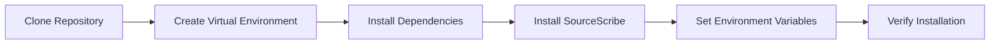

# Installation

# SourceScribe Installation Guide

## Prerequisites

To install and run SourceScribe, you'll need the following:

- Python 3.7 or later
- pip (Python package installer)
- Git (for cloning the repository)

SourceScribe has the following Python dependencies:

- `click`
- `pyyaml`
- `mermaid-diagrams`
- `openai`
- `anthropic`
- `ollama`

## Installation Steps

Follow these steps to install SourceScribe:

1. **Clone the Repository**:
   ```
   git clone https://github.com/your-username/sourcescribe.git
   cd sourcescribe
   ```

2. **Create a Virtual Environment**:
   ```
   python -m venv venv
   source venv/bin/activate  # On Windows, use `venv\Scripts\activate`
   ```

3. **Install Dependencies**:
   ```
   pip install -r requirements.txt
   ```

4. **Install SourceScribe**:
   ```
   pip install .
   ```

## Environment Setup

SourceScribe requires the following environment variables to be set:

- `OPENAI_API_KEY`: Your OpenAI API key (optional, required for OpenAI provider)
- `ANTHROPIC_API_KEY`: Your Anthropic API key (optional, required for Anthropic provider)
- `OLLAMA_API_KEY`: Your Ollama API key (optional, required for Ollama provider)

You can set these variables in your shell or in a `.env` file in the project root directory.

## Verification

To verify the installation, run the following command:

```
sourcescribe --help
```

This should display the SourceScribe command-line interface help.

## Troubleshooting

Here are some common installation issues and their solutions:

**Issue**: Unable to install dependencies
**Solution**: Ensure you have the latest version of pip installed and try again. If the issue persists, check your system's package manager (e.g., `apt`, `yum`, `brew`) for the required dependencies.

**Issue**: Missing API keys
**Solution**: Ensure you have the required API keys set as environment variables. If you don't have the keys, you won't be able to use the corresponding providers.

**Issue**: Command not found
**Solution**: Verify that the `sourcescribe` command is available in your system's PATH. If not, try running `python -m sourcescribe.cli` instead.

Here's a mermaid flowchart that illustrates the installation process:



Remember, if you encounter any other issues, refer to the project's documentation or reach out to the SourceScribe community for assistance.