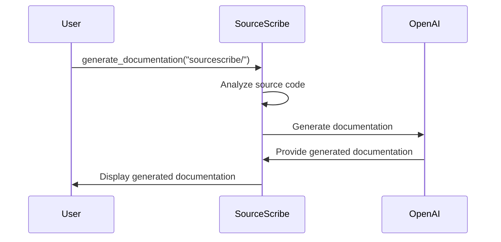

# Quick Start

# SourceScribe Quick Start Guide

Welcome to the SourceScribe Quick Start Guide! This guide will walk you through the minimal setup to get started, a simple "Hello World" example, and an explanation of what's happening under the hood. Let's dive in!

## First Steps

To get started with SourceScribe, you'll need to install the package and set up your configuration. Here's how:

1. **Install SourceScribe**:
   ```
   pip install sourcescribe
   ```

2. **Configure SourceScribe**:
   - Create a new file named `sourcescribe.yml` in your project's root directory.
   - Add the following configuration:
     ```yaml
     api_provider: openai
     api_key: your_openai_api_key_here
     ```
   - Replace `your_openai_api_key_here` with your actual OpenAI API key.

That's it! You're now ready to start using SourceScribe.

## Hello World Example

Let's try a simple example to get a feel for how SourceScribe works. Create a new Python file in your project, e.g., `example.py`, and add the following code:

```python
from sourcescribe.cli import generate_documentation

if __name__ == "__main__":
    generate_documentation("sourcescribe/")
```

Now, run the script:

```
python example.py
```

SourceScribe will analyze the `sourcescribe/` directory and generate documentation for the project.

## What Just Happened?

When you ran the `example.py` script, here's what happened:



1. The `generate_documentation()` function was called, passing the `"sourcescribe/"` directory as the argument.
2. SourceScribe analyzed the source code in the `sourcescribe/` directory, extracting relevant information about the project.
3. SourceScribe then used the OpenAI API to generate the documentation based on the extracted information.
4. The generated documentation was returned to SourceScribe and displayed to the user.

The generated documentation includes an overview of the project, a breakdown of the file structure, and detailed explanations of the various components and their interactions.

## Next Steps

Now that you've seen a simple example, here are some next steps you can take:

1. **Explore the Configuration Options**: SourceScribe supports various configuration options, such as selecting different API providers, customizing the documentation generation, and more. Check out the [SourceScribe Documentation](https://sourcescribe.readthedocs.io) to learn about the available options.

2. **Integrate SourceScribe into Your Workflow**: Consider adding SourceScribe to your project's build or deployment process to automatically generate up-to-date documentation as your codebase evolves.

3. **Customize the Documentation Generation**: SourceScribe provides a flexible and extensible architecture, allowing you to customize the documentation generation process to fit your specific needs. Explore the [SourceScribe Documentation](https://sourcescribe.readthedocs.io) to learn more.

4. **Contribute to SourceScribe**: If you encounter any issues or have ideas for improvements, consider contributing to the SourceScribe project on [GitHub](https://github.com/sourcescribe/sourcescribe). Your feedback and contributions are valuable for making SourceScribe even better.

Happy documenting with SourceScribe!