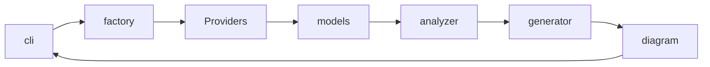
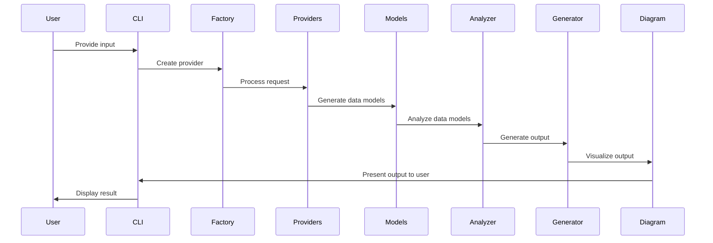
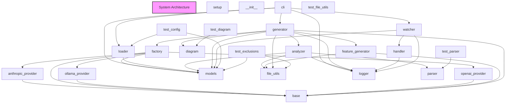

# Architecture Overview

# System Architecture Documentation

## High-Level Architecture

The system is composed of several key modules that work together to provide a comprehensive solution. The high-level architecture can be described as follows:

The main flow starts with the **CLI** module, which serves as the entry point for users. The CLI interacts with the **Factory** module to create the appropriate provider based on user input. The selected **Provider** then processes the user's request and generates the necessary data models.

These data models are then passed to the **Analyzer** module, which examines the models and extracts relevant information. The **Generator** module then uses this analyzed data to generate the final output, which is then visualized by the **Diagram** module and presented back to the user through the CLI.

The system also includes several utility modules, such as **Loader**, **File Utils**, and **Logger**, which provide supporting functionality across the different components.

## Key Components

1. **CLI (Command-Line Interface)**: Handles user input and interacts with the system's core functionality.
2. **Factory**: Responsible for creating the appropriate provider based on user input.
3. **Providers**: Implement the logic to interact with external services, such as Anthropic, OpenAI, and OLLaMA.
4. **Models**: Define the data structures used throughout the system.
5. **Analyzer**: Examines the data models and extracts relevant information.
6. **Generator**: Uses the analyzed data to generate the final output.
7. **Diagram**: Visualizes the generated output and presents it to the user.

## Data Flow

The typical data flow in the system is as follows:

1. The user interacts with the CLI, providing the necessary input.
2. The CLI passes the user input to the Factory, which creates the appropriate provider.
3. The provider processes the user's request and generates the necessary data models.
4. The data models are passed to the Analyzer, which examines them and extracts relevant information.
5. The Analyzer's output is then passed to the Generator, which uses it to generate the final output.
6. The generated output is sent to the Diagram module, which visualizes it and presents it to the user through the CLI.

## Design Principles

The system's architecture follows several key design principles:

1. **Modularity**: The system is divided into well-defined modules, each with a specific responsibility. This promotes maintainability, testability, and flexibility.
2. **Abstraction**: The use of abstract base classes and interfaces in the **base** module allows for easy substitution of different provider implementations.
3. **Separation of Concerns**: The clear separation of concerns between the CLI, Factory, Providers, Analyzer, Generator, and Diagram modules ensures that each component focuses on its specific task.
4. **Dependency Injection**: The Factory module is responsible for creating the appropriate provider, which promotes loose coupling and testability.
5. **Single Responsibility Principle**: Each module and class in the system has a single, well-defined responsibility, making the codebase easier to understand and maintain.

These design principles contribute to the overall robustness, scalability, and extensibility of the system.

## System Architecture Diagram

